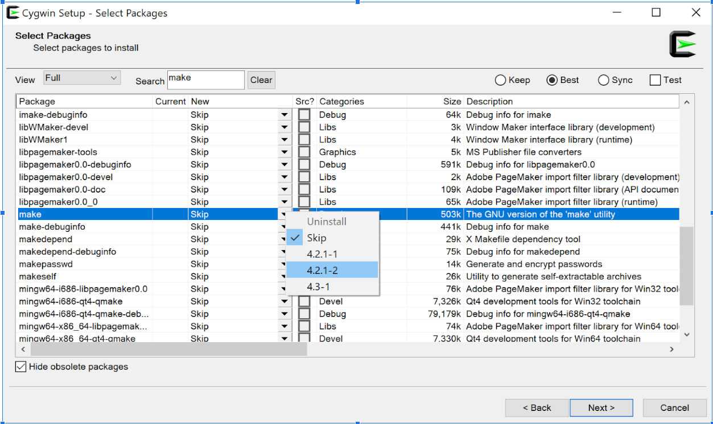

# Recursos para meu Curso de C na Udemy
Aqui você vai encontrar os recursos para o meu [curso de C hospedado na Udemy](http://adrianacerdeira.info/promos/c-promo.php).

# Alguns links meus que podem te interessar:


Se interessar se inscreva no meu Newsletter, link abaixo:

https://www.subscribepage.com/Cbbrnewsletter

Ou no Facebook ou Twitter:

http://facebook.com/ComputerBuddyBR

http://twitter.com/ComputerBuddyBR

E meu canal do YouTube com Dicas:
https://www.youtube.com/computerbuddybr

E eu também criei um Grupo do Facebook para os alunos poderem interagir entre si. Se interessar, corre lá:

https://www.facebook.com/groups/computerbuddybr

E, visite meu site:

http://adrianacerdeira.info/

## Além disso, aqui em baixo vou colocar alguns links úteis e um Cheatsheet para rodar C no Cygwin e Linux.

# Links úteis
- [Curso de Introdução à lógica de Programação](http://adrianacerdeira.info/promos/logica-promo.php)
- [Playlist com Dicas úteis para este curso.](https://www.youtube.com/watch?v=-yPGYL4_IgQ&list=PLhx-V5qg9T6QkiLCLkzaReh0J_9geSe7m) 
- Link para o instalador: https://cygwin.com/
- Link para o vídeo explicando a instalação: https://www.youtube.com/watch?v=-yPGYL4_IgQ 
- [Devdocs](https://devdocs.io/c/) - Documentação super útil em várias linguagens
- Compilador online: [Coding Ground](https://www.tutorialspoint.com/online_c_compiler.php)
- Compilador online: [JDoodle](https://www.jdoodle.com/c-online-compiler/)
- [VSCode Online](https://vscode.dev/)
- [VSCode para instalar](https://code.visualstudio.com/download)
- [Code::Blocks](https://www.codeblocks.org/)
- [CLion](https://www.jetbrains.com/clion/)
- [Netbeans](https://netbeans.apache.org/)
- [Eclipse](https://www.eclipse.org/ide/)
- [Codewars](https://www.codewars.com/)
- [Cheatsheet de comandos de terminal Linux](https://www.guru99.com/linux-commands-cheat-sheet.html)

# Instalando o Cygwin em Windows

Ir para https://cygwin.com/install.html e baixar o instalador do Cygwin para seu sistema

Ao instalar, seguindo os passos você vai chegar em uma janela com packages. Você tem que buscar os seguintes packages


```
gcc-g++
make
gdb
```

Use a caixa Search para buscar e na coluna New você vai escolher a versão. Verifique na imagem abaixo como selecionar para instalar. Você clica na flecha do pacote desejado e escolhe a maior versão mais estável.


Siga os passos de instalação e ao final vai pedir para colocar um atalho, selecione criar atalho na área de trabalho. Facilita a vida.

No atalho clique com o botão direito e clique em "Abrir local do arquivo". Você vai reparar que aí tem uma pasta home. E se vc entrar vai ver que criou uma pasta para cada usuário do windows dentro dessa pasta. Quando você clica e roda o Cygwin Terminal é aí que ele vai. Isso ocorre porque o Cygwin é um emulador de Linux, como se fosse uma leve máquina virtual. Então salve seus projetos dentro dessas pastas e rode pensando que o root é a pasta de instalação do Cygwin

Esse terminal é um emulador de terminal de Linux então os comandos usados aqui não são os de Windows são os de Linux:


**Para compilar:** 
```
gcc -o nomeArquivoCompilado nomeArquivoCodigo.c -lm
```
**Para rodar:** 
```
./nomeArquivoCompilado
```

E isso independe do IDE que você usar. Bem mais simples do que tentar fazer o IDE funcionar.


# Instalando C em Linux:

Rode os comandos abaixo no Terminal.

```
sudo apt upgrade

sudo apt install build-essential
```

# Instalando C em Mac
Eu não sou usuária Mac, então esta explicação foi tirada da internet em: https://stackoverflow.com/questions/32337643/how-can-i-run-a-c-program-on-mac-os-x-using-terminal

Se estiver errada peço que meus alunos que usam Mac me avisem.

- Você deve ir no AppStore e Instalar o XCode
- Depois você deve instalar as ferramentas de linha de comando abrindo o Terminal e rodando 
```
xcode-select --install
```
- Para compilar e rodar você usa os mesmos comandos que em Linux.

# Compilando e rodando arquivos em Linux, Mac e no Cygwin
Navegue até a pasta do arquivo no terminal e rode o seguinte comando 

```
gcc -o <Nome do arquivo exe que quero compilar> <Nome do arquivo C com extensão> -lm
```

Então ficaria:
```
gcc -o meuExecutavel meuArquivo.c -lm
```

Depois, para rodar, você usa o executável sem extensão.

```
./meuExecutavel
```

# Colinha para os placeholders dos tipos nos Strings

```
%d -> int
%f -> float
%lf -> double
%c -> char
%s -> string
%p -> ponteiros
```

# Precedência de Operadores
- https://devdocs.io/c/language/operator_precedence